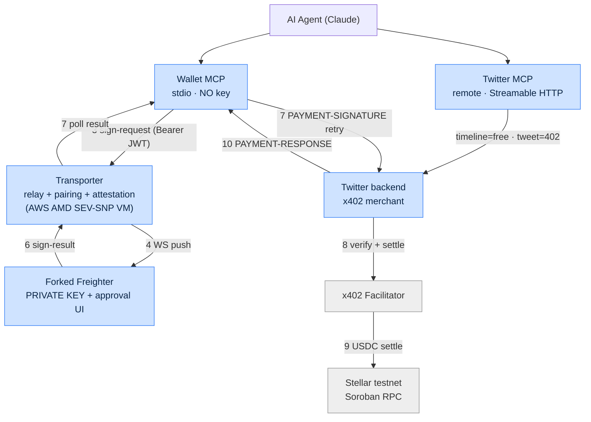

# Architecture

> Manifest §5 & §17. Blue = our components; gray = external systems.

AI agents make on-chain x402 payments and general Stellar transactions **without
ever holding the user's private key**. When the agent needs a signature, the
request lands in the user's own wallet (a forked Freighter), the user approves by
hand, and the agent continues. The key only ever lives in the wallet.

(Raw diagram source: [`wallet-mcp-architecture.mermaid`](./wallet-mcp-architecture.mermaid).)

## Components → workspaces

| Manifest component                | Workspace                                  | Runs where           | Holds key? |
| --------------------------------- | ------------------------------------------ | -------------------- | ---------- |
| 1 · Wallet MCP                    | [`apps/wallet-mcp`](../apps/wallet-mcp)    | Agent host (stdio)   | **No**     |
| 2 · Transporter                   | [`apps/transporter`](../apps/transporter)  | AWS AMD SEV-SNP VM   | **No**     |
| 3 · Forked Freighter              | [`apps/freighter`](../apps/freighter)      | Browser extension    | **Yes**    |
| 4 · Mock Twitter (merchant)       | [`apps/twitter-backend`](../apps/twitter-backend) | Any host      | No         |
| 4 · Mock Twitter (remote MCP)     | [`apps/twitter-mcp`](../apps/twitter-mcp)  | Any host (remote MCP)| No         |

> The manifest's single "Mock Twitter x402 MCP" is split into a **backend**
> (x402 merchant) and a **remote MCP server** so each deploys independently.

## Design rules

- **No shared workspace packages.** Each app is self-contained (no `workspace:*`
  deps) so it can be deployed on its own. The transporter API contract is the
  shared interface — its source of truth is [`api-transporter.md`](./api-transporter.md);
  apps keep their own local copy of the types.
- **The forked Freighter** keeps its own Yarn toolchain and is excluded from the
  Bun workspaces / Biome (see `apps/freighter/FORK_NOTES.md`).
